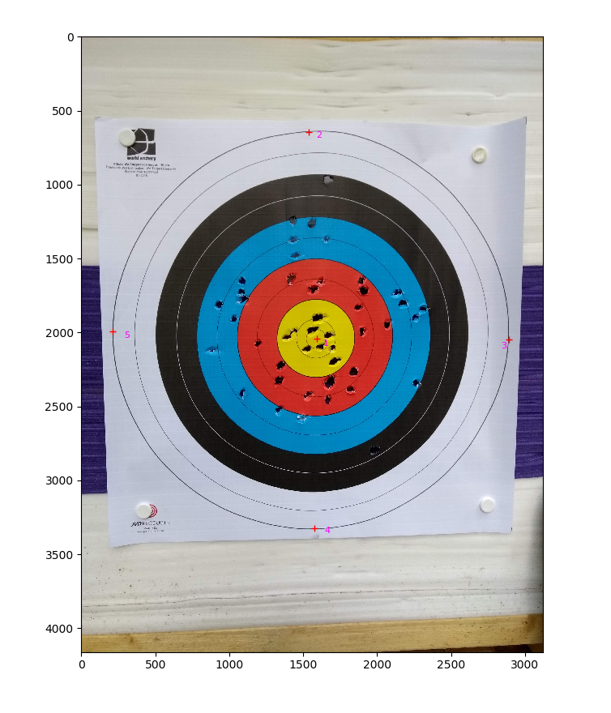
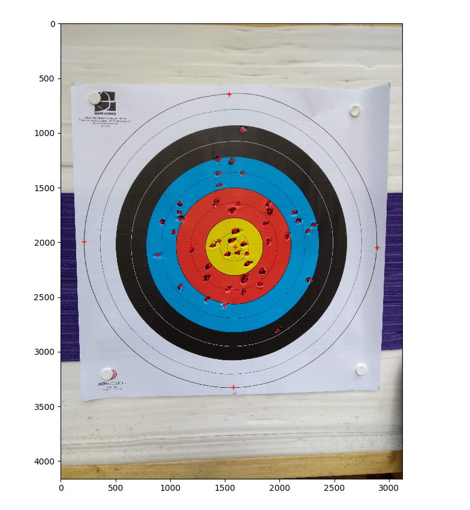
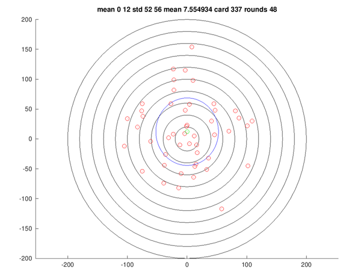

# Postprocess Pictures of Target Faces for Archery Stats

If you are looking for some sort of image processing approach 
for generating statistics, this is not it.

## Prerequisites

This has only been tested on Debian 10, with a little ingenuity 
I'm sure that it could work on other platforms which I'm less 
interested in.

You will need python, python-matplotlib and Octave.

## Workflow

This looks complex but really only takes a couple of minutes once you
are used to the process.

1. Obtain a new target face.
2. Shoot some arrows at it.
3. Take a picture of the target face with your mobile phone, try to keep the phone vertical and ensure that the outer circle of the target is completely within the frame. 
4. By downloading from Google Photos, or by other means, get the photograph into this directory.
5. From a command prompt in this directory, run the following command _but use your own target JPG file in place of mine_

        python picker.py IMG_20200614_122251650.jpg > IMG_20200614_122251650.jpg.points

6. The picker program will display your target photograph in a window. It's best to maximise that window before you go any further.
7. It's important that the program understands the dimensions of the target. In order to inform the program left click first on the precise center of the target, then at the point on the outer circle directly above that, then on the point on the outer circle to the right of the center, then the point at the bottom of the outer circle then at the left. 
8. That's center, top, right, bottom, left. Essentially center then clockwise around the outer ring.
9. If you make a mistake at any point, it seems as if you can press delete to undo.
10. Having made an accurate selection of the first three points, click on every arrow hole in the target.
11. You should end up with something like this: 
12. Press [Enter], then close the Matplotlib window.
13. If you cat the .points file then it should contain two columns of numbers.
14. Again from a command line prompt in this directory, type this _but with your newly created .points file_:

        octave post.m  IMG_20200614_122251650.jpg.points

15. This will create two new files in the directory, in my case:

        IMG_20200614_122251650.jpg.points.png
        IMG_20200614_122251650.jpg.points.stats 

        

17. The first of those is a plot of the target with the arrow marks, the title summarises the stats. There should be a green dot at the mean position, a blue ellipse for the standard deviation and red dots for the arrow holes.
18. The second is just a dump of the octave variables, in case you'd like to do some more maths.

I hope you are better at archery than I am.
